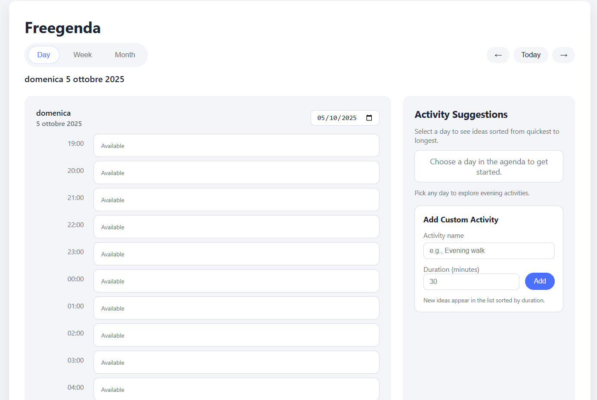

# Freegenda

Freegenda is a lightweight evening and early-morning agenda planner that helps night owls map out their most flexible hours. It ships as a static web app with no build step, so you can open it directly in a browser or drop it onto any static host.

## Preview


## Features
- Toggleable day, week, and month views that sync to the currently selected date
- Agenda timeline focused on 19:00–07:00 with quick slot allocation and removal
- Curated activity ideas sorted by duration, plus support for custom activities
- Keyboard-friendly navigation (Esc to clear selections, arrow buttons for navigation)
- Accessible, responsive layout with live region updates for screen readers

## Getting Started
1. Clone or download this repository.
2. Open `index.html` in your preferred browser, or serve the directory with a simple static server:

   ```bash
   python3 -m http.server 8000
   ```

3. Navigate to `http://localhost:8000` and start planning.

No build tooling or dependencies are required.

## Usage Tips
- Pick a view (Day, Week, or Month) to explore different time ranges.
- Click a timeslot between 19:00 and 07:00 to allocate the currently selected activity.
- Use the form on the right to add custom activities; new items appear sorted by duration.
- Press `Esc` to clear your current selection if you mis-click or want to start fresh.

## Project Structure
- `index.html` — root HTML document and application shell
- `styles.css` — application layout, theming, and responsive styling
- `script.js` — agenda logic, state management, and DOM rendering

## Development Notes
- The app relies on vanilla JavaScript; no frameworks are required.
- When modifying the agenda logic, keep the `STATE` shape and rendering helpers in `script.js` synchronized.
- Run your changes in multiple view sizes to confirm the responsive grid and live regions behave correctly.

## Contributing
Please see [CONTRIBUTING.md](CONTRIBUTING.md) for guidelines on proposing changes and reporting issues.

## Changelog
Key releases and highlights live in [CHANGELOG.md](CHANGELOG.md).

## License
Freegenda is distributed under the Freegenda GitHub Source-Available License (FGSAL). The license permits personal evaluation on GitHub only; commercial use, redistribution, and public forks are prohibited. See [`LICENSE`](LICENSE) for the full terms.
